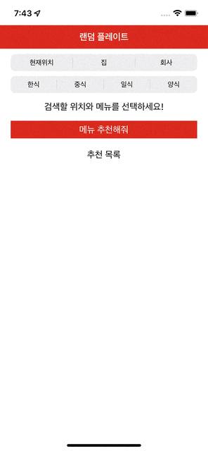

# 공통프로젝트

각자 공부한 내용을 바탕으로 공통주제 모바일앱 개발하기

## 주제정하기 - 22/6/8

- **주제**: 랜덤 메뉴 추천
  - 문자열 목록을 가지고 있다가 사용자가 버튼 누르면 랜덤하게 추천
  - 공개 API/데이터를 활용하여 추천
    - [지역 - Search API (naver.com)](https://developers.naver.com/docs/serviceapi/search/local/local.md)
    - [좌표제공 API | 도로명주소 개발자센터 (juso.go.kr)](https://www.juso.go.kr/addrlink/devAddrLinkRequestGuide.do?menu=coordApi)
- ==**1차목표**: 회사근처(논현~신논현) 랜덤한 메뉴 추천==
- **2차목표**: 현재 위치 200m 안에서 랜덤한 메뉴를 추천
  - 위치정보는 어떻게 다뤄야할까
  - API/주소를 어떻게 좌표로 바꾸고, 다시 근처 맛집을 어떻게 추출해내나
  - 가게 정보를 백그라운드에서 불러온다면 어느 주기로 해야할까?
    - 화면 열 때마다
    - 백그라운드 수시
    - 리프레시 버튼을 누르면
    - 메뉴만 바꾸고 싶을 때, 음식점을 바꾸고 싶을 때

## 중간공유 - 22/6/16

- **API 비교/선택**
  - 랜덤정보
    - 서울시 일반음식점 인허가정보(4만여건) 중에서 랜덤하게 선택 [LOCALDATA - 지방행정인허가데이터개방:데이터다운로드](https://www.localdata.go.kr/devcenter/dataDown.do?menuNo=20001) 
    - ==네이버 API로 '위치 + 메뉴이름' 검색하고 랜덤하게 선택==
  - 세부정보
    - 네이버 API로 상세정보를 불러와 사용자에게 보여주기 [지역 - Search API (naver.com)](https://developers.naver.com/docs/serviceapi/search/local/local.md)

| 구분                      | 네이버 :white_check_mark:                                  | 구글                                                         | 행정안전부 :white_check_mark:                           |
| ------------------------- | ---------------------------------------------------------- | ------------------------------------------------------------ | ------------------------------------------------------- |
| API 명                    | 검색/지역                                                  | Map/Place Search                                             | 서울시 일반음식점 <br />인허가정보                      |
| 가격정책                  | 무료                                                       | $17/1천건<br />([과금정책 페이지]([Platform Pricing & API Costs - Google Maps Platform](https://mapsplatform.google.com/pricing/?hl=ko))) | 무료                                                    |
| 제공방식                  | REST                                                       | REST                                                         | 데이터셋/REST<br />기초자료는 다운받고, 변동분은 REST로 |
| 제공정보                  | 장소                                                       | 장소                                                         | 음식점                                                  |
| 제공정보 세부             | 업체명, <br />상세정보 링크, <br />전화정보, <br />주소 등 | 업체명,<br />전화번호,<br />주소,<br />사진,<br />평점,<br />가격대 등 | 업체명,<br />전화번호,<br />주소 등                     |
| 호출횟수                  | 일일2만5천건                                               | 제한없음                                                     | 제한없음                                                |
| 호출건당 <br />데이터개수 | 최대 5개                                                   | 제한없음                                                     | 최대 1천개<br />(4만6천여건)                            |

- 40만줄 이상되는 XML파일을 어떻게 파싱할까?
- 파싱한 결과를 어떻게 보관하고 접근할까?

## 결과공유 - 22/7/1

- **V1** API호출과 UI라벨뷰 / **V2** 스크롤, 카드뷰 적용



-  **V3** 버튼추가, 외부앱 열기


### 무엇을

- ==REST로 음식점 정보를 조회하고 화면에 뿌려주기==
- 스크롤도 되고 예쁘게 만들기
  - ==스택 뷰 아래 항목들 예쁘게 만들기== : 카드뷰
  - ==스크롤이 되게끔 하기==
  - ==스택 뷰 항목 선택하면 맵뷰 보여주기== : 다른앱 연결
  - tableview로 바꿔서 만들어보기
  - 집/회사 위치정보 사용자 입력받기
  - 메뉴 카테고리 사용자 입력받기, 또는 더 다양하게
- 음식점 인허가 정보를 활용해서 더 랜덤하게 만들기
  - 대량의 XML 파싱 어떻게?
  - 데이터 업데이트는 어떻게?
  - 근처에 있는 음식점은 어떻게 추려내지?
  - 상세정보는 어떻게 조회하지?
- swiftUI 써보기


### 어떻게

- **scrollview 아래 taskview를 추가하고, 항목들은 동적으로 생성했다**
  - constraint를 모두 설정해줘야 동적 생성이 가능하다
  - addArrangedSubview
  - removeArrangedSubview

- **URLSession, URLRequest, dataTask로 REST 요청을 처리했다**
  - 응답은 codable 프로토콜을 채택해 JSON 디코드용 모델을 만들어줬다
  - @escaping 클로저를 전달해 결과값을 dataTask 클로저 밖으로 빼냈다
  - DispatchQueue.main.async로 UI 업데이트를 비동기 처리했다

> **람다와 클로저**
>
> 람다와 클로저는 함수를 축약하여 표현한 것이다. 변수에 할당하거나, 함수 인자로 넘길 수 있다. 이러한 동작을 '함수를 1급 객체로 취급한다'고 표현한다.
>
> ```java
> //java
> () -> { 
> 	/*statements*/
> }
> ```
>
> ```swift
> //swift
> {
> 	() -> returnType in 
> 	/*statements*/
> }
> ```
>
> 자바의 람다는 힙에 생성되고, 스택 변수의 값은 복사해서 사용한다(이런 동작을 변수 캡처라고 한다.) 따라서 외부 스택 변수를 변경할 수 없다. 그래서 자바 람다에서 참조하는 외부 변수는 final로 선언하거나 그렇게 간주해야 한다.
>
> 그러나 스위프트의 클로저는 외부 변수를 변경할 수 있다. `self` 등 컨텍스트만 잘 지정해주면 된다.

- **segment control로 검색조건을 입력받았다**
  
  - 현재위치 위치정보는 location manager로 확인했다
  - info.plist에 위치권한을 추가했다
  - 다른 segment를 선택할 때마다 stackview가 초기화되도록 했다
  
- **ScrollView with auto layout**
  
  - ScrollView constraints: leadingSpace, topSpace, TrailingSpace,, bottomSpace to superView, alt 키를 누르면서 margin없이 constraint를 추가
  - UIViews inside scrollView as container: leadingSpace, topSpace, trailingSpace, bottomSpace to ScrollView, alt 키 안누르고 constraint를 추가하고 equalWidth to ScrollView를 해준다(세로 스크롤)
  - views inside this container view: container view 안의 모든 view는 각각 top이 다른 view의 bottom을 바라봐야 한다. 그래야 containerView 높이를 계산할 수가 있다. 만약 동적으로 뷰를 생성하는 경우 빈 labelView를 추가해서 경고창을 지울 수 있다.
  - [objective c - iOS ScrollView needs constraint for y position or height - Stack Overflow](https://stackoverflow.com/questions/35624873/ios-scrollview-needs-constraint-for-y-position-or-height)
  
- **custom cardView inside stackView**
  
  - 깃헙에서 swift로 구현한 카드뷰를 찾아 적용함
  - xib라는 형식으로 UI를 구현해놓고 재사용하는 방식
  - [cardview · GitHub Topics · GitHub](https://github.com/topics/cardview?l=swift)
  - [[SwiftUI] 카드 UI 예제(swiftUI) (tistory.com)](https://lucidmaj7.tistory.com/10)
  - [umarF/capsuleview: An easy to use drop-in view to create a beautiful card style effect with a title placeholder and body content. (github.com)](https://github.com/umarF/capsuleview)
    - [iOS UI 구성 방법에 대하여 [StoryBoard, Code, Xib(Nib), 기능, 장점, 단점, 언제 사용해야 적합할까, Nib와 Xib의 차이] (tistory.com)](https://iamthejiheee.tistory.com/247?category=1088042)
    - [[iOS] "Could not load NIB in bundle" 문제 발생한 경우 (1004lucifer.blogspot.com)](http://1004lucifer.blogspot.com/2014/11/ios-could-not-load-nib-in-bundle.html)
    - [HTML을 AttributedString으로 변환하기 - 뀔뀔(swieeft)의 개발새발기](https://swieeft.github.io/2020/07/12/HTMLToAttributedString.html)
  - [ios - Do card view with Swift - Stack Overflow](https://stackoverflow.com/questions/28141021/do-card-view-with-swift)
  
- **touch event**

  - ios는 클릭이벤트에서 외부 변수를 활용하기가 매우 까다로움

    - 해결방법
      - 버튼에 태그를 추가한다. 태그로 버튼을 구별, 외부 객체에 접근할 때도 태그를 활용
  
      - tweak으로 터치 핸들러를 정의한 뒤, 해당 객체를 외부 객체에 담아 레퍼런스를 유지한다
  
  
    ```java
    //버튼을 생성하는 곳에서 이벤트 리스너를 정의
    btn.setOnClickListener(new View.OnClickListener(){
          @Override
          public void onClick(View v){
            //do something
          }
    }
    ```
  
    ```swift
    //버튼을 생성하는 곳과 터치 핸들러 정의하는 컨텍스트가 다름
    btn.addTarget(self, #selector(self.onBtnClicked(_:)), for: .touchUpInside)
    
    //매개인자를 추가할 수 없음
    @objc func onBtnClicked(_ sender: UIButton){
      //do something
    }
    ```

  - 스크롤뷰 안의 뷰는 터치 액션이 기본적으로 캔슬되기 때문에 별도 설정 필요, 이어서 스크롤뷰 내부 터치 액션을 허용하면 해당 뷰 위에서 스크롤이 되지 않아 별도 설정 필요

  - [ios - How to add a touch event to a UIView? - Stack Overflow](https://stackoverflow.com/questions/4660371/how-to-add-a-touch-event-to-a-uiview)

  - [iphone - UIButton inside UIScrollView doesn't fire on tap - Stack Overflow](https://stackoverflow.com/questions/3132147/uibutton-inside-uiscrollview-doesnt-fire-on-tap)

  - [Attach parameter to button.addTarget action in Swift - Stack Overflow](https://stackoverflow.com/questions/24814646/attach-parameter-to-button-addtarget-action-in-swift)
  
  - [[iOS] URL Scheme로 다른 앱과 통신하기 (tistory.com)](https://lxxyeon.tistory.com/114)
  
  - [[swift] openURL was deprecated in iOS 10.0 (tistory.com)](https://sulkunblog.tistory.com/47)
  
  - [[Swift] 통합 로깅 시스템으로 로깅 해보자!: OSLog (velog.io)](https://velog.io/@ryan-son/Swift-통합-로깅-시스템으로-로깅-해보자-OSLog)


### 앞으로

- UIView autolayout, constraint, anchor
- adaptive layout
- gestureRecognizer, scrollview/button touch
